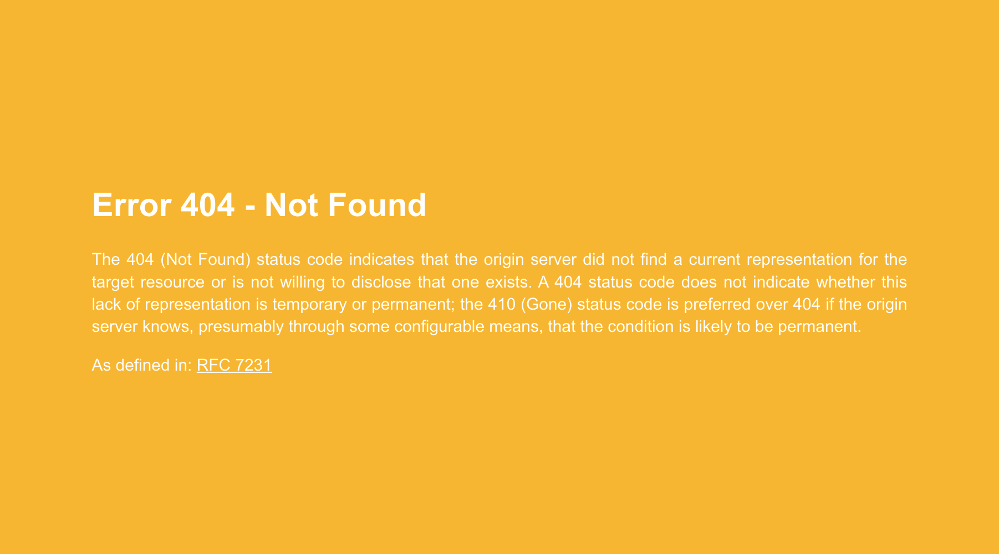
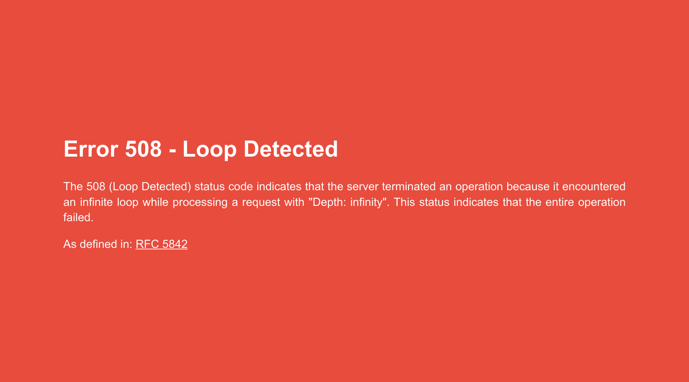
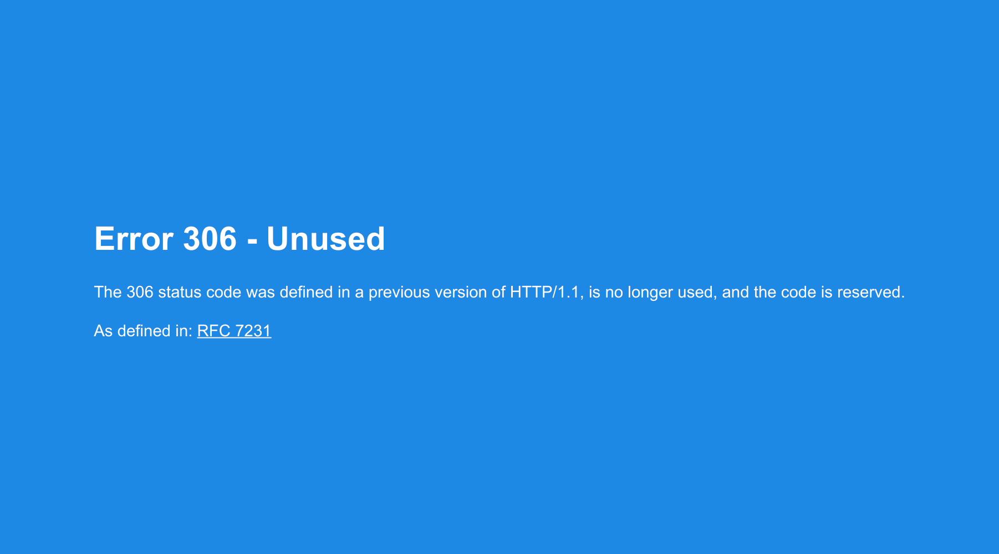

# Penalty Flag

A colorful custom error pages server for use with the NGINX ingress controller
for Kubernetes.

# About

Penalty Flag is a custom error page server derived from the upstream example
within the Kubernetes [NGINX Ingress][nginx-ingress] repository.

The idea is that, in the same way that the color of a referee's flag bears
meaning for particpants and spectators of a football game, this custom error
server provides more colorful (and generally useful) "flags" when something goes
wrong with a request processed by ingress.

# Screenshots

<!--
# Setup

# Troubleshooting

# Development

-->
[nginx-ingress]: https://github.com/kubernetes/ingress-nginx
<!--
vim: ts=2 sw=2 et tw=80
-->
